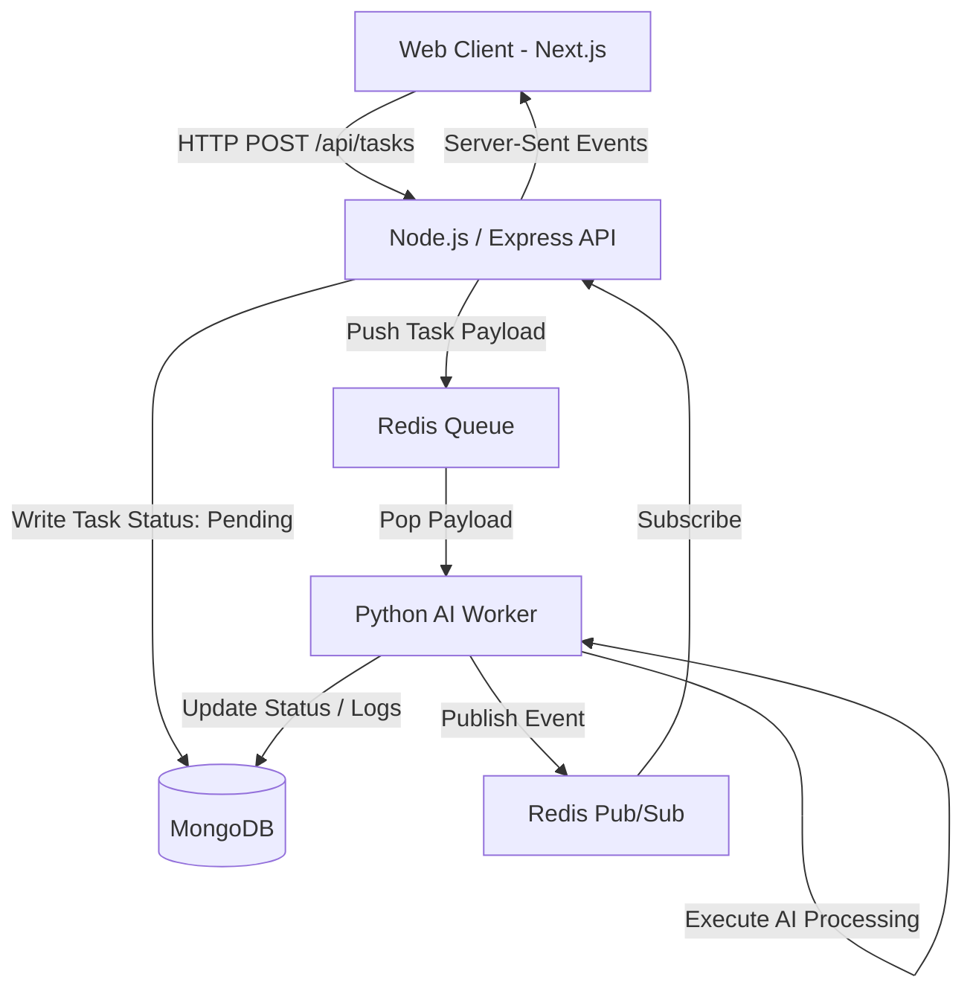

# AI Task Processing Platform: System Architecture & Engineering Strategy

## 1. Executive Summary
The AI Task Processing Platform is a highly available, distributed asynchronous processing system designed to handle natural language processing tasks at scale. Built strictly around the principles of decoupled microservices and event-driven architecture, the platform separates the high-throughput frontend API layer from the heavy compute backend worker layer. 

By leveraging the **MERN Stack** (MongoDB, Express, React, Node.js) paired with a **Python worker ecosystem** and **Redis** for state buffering, the system is engineered to effortlessly handle loads of 100,000+ tasks per day while maintaining robust fault tolerance, real-time client updates, and strict security compliance.

---

## 2. High-Level System Architecture

The core tenet of the architecture is the **Asynchronous Event-Driven Pattern**. User requests are never blocked by heavy computations.

1. **Ingestion**: The Node.js API acts as a high-speed ingestion layer. It immediately persists a `pending` state to MongoDB and pushes a processing job onto a Redis list.
2. **Execution**: Python workers, operating asynchronously, constantly poll the Redis list. Because they are decoupled, they can scale entirely independently of the API layer.
3. **Real-time Feedback**: Upon state changes (e.g., `running`, `success`, `failed`), the worker publishes an event to Redis Pub/Sub, which the Node.js API picks up and streams directly back to the client via Server-Sent Events (SSE), completely eliminating the need for expensive client-side polling.

---

## 3. Worker Scaling Strategy
A primary engineering challenge is ensuring the heavy computational layer can scale dynamically to handle spikes in traffic without over-provisioning infrastructure.

* **Stateless Design:** Python workers share zero state. All state is maintained in Redis (queue) and MongoDB (data). This allows worker pods to be killed or spun up instantly.
* **Horizontal Pod Autoscaling (HPA):** In our Kubernetes cluster, the worker `Deployment` is configured to scale horizontally. While standard CPU/Memory metrics are utilized, the ideal scaling metric in a production cluster relies on **Custom Metrics (KEDA)** tied directly to the `task_queue` length in Redis. If the queue length exceeds a set threshold (e.g., > 50 pending tasks), the cluster dynamically provisions additional worker replicas to chew through the backlog.
* **Graceful Degradation:** By separating ingestion from processing, a massive influx of traffic will simply grow the Redis queue, rather than crashing the database or the API.

---

## 4. Handling High Task Volume (100k+ Tasks/Day)
Handling 100,000 tasks per day equates to an average of **~1.15 tasks per second**, but production systems must be engineered for burst traffic (e.g., 50+ tasks/second during peak hours).

1. **In-Memory Buffering:** By placing Redis directly in front of the processing workers, we protect MongoDB from write-contention spikes. Redis acts as a high-speed shock absorber capable of ingesting hundreds of thousands of operations per second.
2. **Connection Pooling:** Both the Node.js API and the Python worker utilize robust connection pooling to MongoDB, preventing TCP port exhaustion under heavy concurrent load.
3. **Elimination of Polling:** By transitioning from traditional HTTP polling to Server-Sent Events (SSE) via Redis Pub/Sub, we have drastically reduced the inbound HTTP request volume on the API layer, freeing up the Node.js event loop to solely handle ingestion and static asset delivery.

---

## 5. Database Architecture & Indexing Strategy
As the system processes 100k tasks daily, the MongoDB `tasks` collection will grow rapidly. Without a strict indexing strategy, read performance degrades severely.

* **Compound Indexes (`{ userId: 1, createdAt: -1 }`):** Because the primary user dashboard queries tasks scoped to the currently logged-in user and sorts them by recency, a compound index completely eliminates in-memory sorting and enables instant pagination.
* **Text Indexing (`{ title: "text", inputText: "text" }`):** To support high-speed global searching across task inputs and titles, a native MongoDB text index is applied.
* **Time-To-Live (TTL) Indexing (`{ createdAt: 1 }`):** To prevent the database from ballooning indefinitely, a TTL index is configured on the `createdAt` timestamp. This automatically prunes task logs older than 30 days, serving as an automated data retention policy.

---

## 6. Fault Tolerance & Redis Failure Handling
Redis is the critical nerve center of this application. Its failure or the failure of a worker mid-execution must be handled gracefully.

1. **Dead Letter Queues (DLQ):** If a Python worker encounters an unhandled exception or an API rate limit, it utilizes a retry mechanism. If a task exhausts its maximum retry count, it is automatically pushed to a separate `task_queue_dlq` inside Redis, alongside the exact stack trace and failure timestamp. This ensures no task data is ever silently dropped.
2. **Redis Persistence:** Redis is configured with **AOF (Append Only File) persistence**. In the event of a container crash or node reboot, Redis automatically rebuilds the queue state from the transaction log upon restart, ensuring pending tasks survive infrastructure failures.
3. **Idempotency:** Worker operations are designed to be idempotent. If a worker crashes mid-execution and the task is re-queued, re-running the operation will not corrupt the database state.

---

## 7. Deployment Strategy: Staging vs. Production
The infrastructure utilizes **GitOps methodology via Argo CD**, tracking the `Infrastructure repository` for declarative infrastructure changes.

### Staging Environment
* Runs entirely inside a logically isolated Kubernetes `namespace` (e.g., `ai-task-platform-staging`).
* Manifests are managed via a Kustomize overlay (`/overlays/staging`) which patches the base manifests to use smaller resource limits (e.g., lower CPU requests) and connects to a staging database.
* Merges to the `develop` branch automatically trigger a CI/CD build and an Argo CD sync to this namespace.

### Production Environment
* Managed by a separate Kustomize overlay (`/overlays/prod`) applying strict `ResourceQuotas`, HPA, and multi-replica minimums.
* Triggered explicitly by tagging a release or merging to `main`.
* **Zero-Downtime Rollouts:** Kubernetes Deployments utilize `RollingUpdate` strategies with strict `readinessProbes`. During a deployment, new worker and backend pods are spun up. Old pods are only terminated once the new pods report a healthy state via their HTTP health check endpoints, ensuring active tasks are not abruptly killed and API requests never drop.

---

## 8. Security Posture
Security is baked into multiple layers of the application stack:

* **Authentication:** Stateless JSON Web Tokens (JWT) eliminate session management overhead.
* **Data at Rest:** User passwords are hashed utilizing `bcrypt` with an elevated work factor (12 rounds) to resist brute-force/rainbow table attacks.
* **Injection Defense:** The Express layer utilizes `express-mongo-sanitize` to strip prohibited characters (`$`, `.`) from request bodies, neutralizing NoSQL injection attacks.
* **Container Hardening:** All Dockerfiles employ multi-stage builds to strip development dependencies from the final image, significantly reducing the attack surface. Furthermore, the runner stages execute under highly restricted, non-root users (`node` and `workeruser`), preventing privilege escalation in the event of a container breach.
